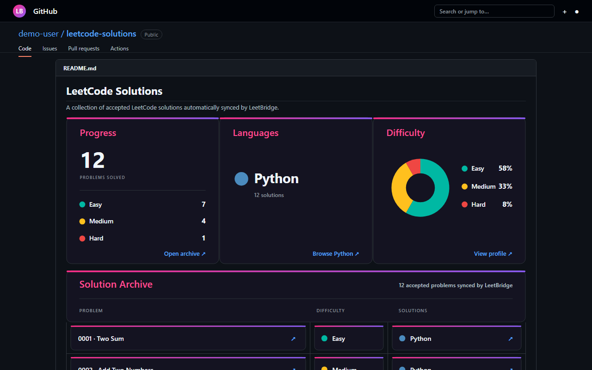

# LeetBridge


LeetBridge is a privacy-conscious Chrome extension that detects accepted
LeetCode submissions and saves the submitted source code to a GitHub
repository selected by the user.

[Install LeetBridge from the Chrome Web Store](https://chromewebstore.google.com/detail/gbaehcgejpbkdpmihkhapjkinclpajko)

## Features

- Detects the current LeetCode problem, difficulty, user, and submission state.
- Captures the language and exact source code only when the user submits it.
- Syncs accepted solutions directly from Chrome to GitHub.
- Prevents duplicate syncs using LeetCode submission IDs.
- Maintains problem READMEs and a repository-wide, clickable solution archive.
- Generates matching Progress, Languages, and Difficulty SVG cards without
  relying on an external statistics service.
- Builds the solution archive from reusable SVG components while keeping
  problem and solution-file links clickable.
- Imports the latest accepted historical solution for each problem and language.
- Rebuilds the root README from solution folders when recovery is needed.
- Includes Auto Sync and README update controls in the popup.
- Limits GitHub access through a fine-grained GitHub App installation.
- Requires no personal access token, local Git installation, or code setup from
  extension users.

## How it works

```text
LeetCode problem page
        ↓
Content scripts normalize problem and submission data
        ↓
Background service worker stores the current state
        ↓
GitHub Contents API writes the solution and generated indexes
        ↓
<four-digit-number>-<slug>/
├── README.md
└── solution.<extension>
```

Example output:

```text
README.md
.leetbridge/
├── archive/
│   ├── difficulties/
│   │   ├── easy.svg
│   │   ├── hard.svg
│   │   └── medium.svg
│   ├── languages/
│   │   └── python-<id>.svg
│   ├── problems/
│   │   └── 0001-two-sum.svg
│   └── header.svg
├── difficulty.svg
├── languages.svg
└── progress.svg
0001-two-sum/
├── README.md
└── solution.py
```

The repository README displays linked progress, language, and difficulty cards,
followed by a clickable solution archive. The cards are stored in the
`.leetbridge` directory in the solutions repository, so they do not depend on
an external stats service. The language card expands to a ranked, segmented
view when solutions use multiple languages, the difficulty card opens the
owner's LeetCode profile, and the archive is assembled from matching SVG
components. Its problem and language cards retain their individual LeetCode
and solution-file links. Content outside the `SOLUTIONS_START` and
`SOLUTIONS_END` markers is preserved when LeetBridge refreshes the generated
section.

## Generated repository preview



The Progress card jumps to the solution archive, Languages opens the relevant
repository code, and Difficulty opens the owner's LeetCode profile. Within the
archive, problem cards open their LeetCode questions and language cards open
the corresponding source files.

## User flow

1. Install LeetBridge from the Chrome Web Store.
2. Open LeetBridge and choose **Connect GitHub**.
3. Grant LeetBridge access to a dedicated solutions repository and authorize
   the connection.
4. Select the repository in LeetBridge.
5. Submit a solution on LeetCode. Accepted solutions sync automatically.

The popup also lets users import previous accepted solutions, pause automatic
syncing, disable generated README updates, and rebuild the repository index
from the solution folders.

Historical import reads 20 submissions per request and continues until LeetCode
reports the end of the history. There is no fixed total-submission cutoff.
Requests are paced, and temporary throttling is retried with a cooldown.
Keep the LeetCode tab open during import. If an import stops, Resume continues
from a saved page checkpoint and skips solutions already handled. Start new
import scans again from the beginning. Access denials and verification checks
still require attention on LeetCode; the extension does not bypass them.

Users never edit extension files or paste authentication tokens.

## Security and privacy

LeetBridge has no developer-operated data backend. GitHub credentials remain
in trusted Chrome extension storage, and accepted code is sent directly to the
repository chosen by the user. The repository contains only the public GitHub
App client ID and app slug, never a client secret or private key.

GitHub's Contents permission applies to the complete selected repository, so a
dedicated solutions repository is recommended to keep access isolated.

Read the complete [privacy policy](PRIVACY.md) and
[security policy](SECURITY.md).

## Development

1. Clone the repository.
2. Open `chrome://extensions`.
3. Enable **Developer mode**.
4. Choose **Load unpacked** and select this repository.
5. Open a LeetCode problem and inspect LeetBridge from the toolbar.

## Project structure

```text
background/   GitHub access, settings, importing, and trusted storage
content/      LeetCode detection and normalized data extraction
github/       In-extension GitHub connection screen
popup/        Toolbar popup
resources/    Runtime extension icons and artwork
```

## Status

Version 1.0.3 includes live accepted-submission syncing, the SVG repository
dashboard and archive, resumable historical import, README conflict recovery,
repository rebuild tools, and guided onboarding. The LeetCode interface can
change, so selectors and submission detection are reviewed before each store
release.

## License

LeetBridge is source available, not open source. The code may be viewed for
portfolio evaluation, but no permission is granted to use, copy, modify, or
redistribute it without prior written permission. See [LICENSE](LICENSE).
